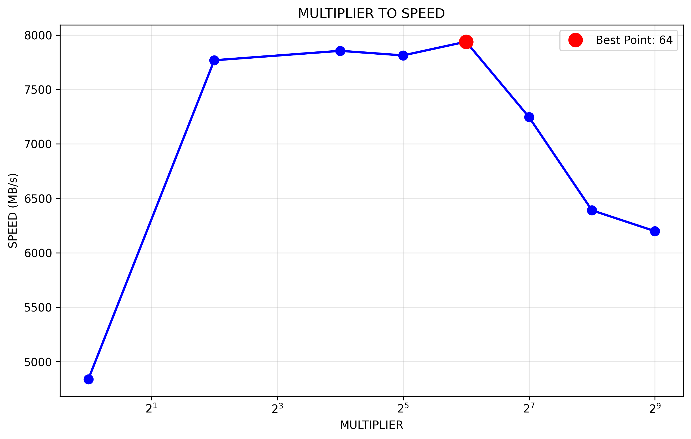

# MeowHW实验报告

| 姓名 | 学号       |
| ---- | ---------- |
| 赵霄宇 | 2023200399 |

## 问题回答
## Mycat3
### 为什么将缓冲区对齐到系统的内存页可能提高性能？你的实验结果支持这个猜想吗？为什么？
我认为，可能有以下这几个原因：

减少Page Fault，即当缓冲区对齐到页边界时，操作系统的内存管理单元（MMU）可以更高效地处理内存访问

优化缓存性能，因为页对齐的内存访问更容易被CPU缓存优化，减少缓存缺失

减少内存拷贝，比如某些系统调用（如read/write）在处理页对齐的缓冲区时可能使用更高效的内核路径

因为页对齐确保单次IO操作的数据在连续的物理内存页中，也可以保证避免跨页访问

我的实验结果也是支持这些猜想的，因为性能相较于未对齐时有极大增加，buffer的页对齐确实可以保证Page Fault有效减少

### 为什么我们直接使用`malloc`函数分配的内存不能对齐到内存页，即使我们分配的内存大小已经是内存页大小的整数倍了。
因为malloc通常只保证返回的指针按照 sizeof(void*) 或 sizeof(double) 对齐，且malloc 使用内存池来提高分配效率，不会浪费内存来保证页对齐

同时，malloc是为了通用情况而设计的的内存分配器，不针对特定的对齐需求。严格的页对齐也会导致大量内存碎片，降低内存利用率


### 你是怎么在不知道原始的malloc返回的指针的情况下正确释放内存的？
我在align_alloc中，分配额外内存 = 原始大小 + 页大小 + sizeof(void*)，并在对齐指针前面存储原始的malloc指针。再在align_free中，从对齐指针前面读取原始指针并释放。如此一来，我就可以使用位运算实现页对齐，即(addr + pagesize - 1) & ~(pagesize - 1)。

## Mycat4
### 为什么在设置缓冲区大小的时候需要考虑到文件系统块的大小的问题？
首先是为了减少系统调用开销，因为文件系统以块为单位管理数据，若我们的IO请求大小与文件系统块大小对齐，就可以最大化每次系统调用的效率。同时操作系统和文件系统在处理对齐的块大小请求时，可以避免额外的内存拷贝和缓冲操作。Cache也是按块组织的，故按块大小访问可以提高Cache命中率。（按块大小读写也许还可以减少磁盘寻道时间）

### 对于上面提到的两个注意事项你是怎么解决的？
**注意1**. 文件系统中的每个文件，块大小不总是相同的。

代码如下
```python
// 修改io_blocksize函数接受文件描述符参数
size_t io_blocksize(int fd) {
    // 使用fstat()为每个文件单独获取块大小
    struct stat st;
    if (fstat(fd, &st) == 0 && st.st_blksize > 0) {
        fs_blocksize = st.st_blksize;
    }
}

// 在主函数中先打开文件，再获取该文件的最优块大小
fd = open(argv[1], O_RDONLY);
blocksize = io_blocksize(fd);  // 针对具体文件优化
```

**注意2**. 有的文件系统可能会给出虚假的块大小，这种虚假的文件块大小可能根本不是2的整数次幂。

代码如下
```python
/ 检查块大小是否为2的幂
static int is_power_of_two(size_t n) {
    return n > 0 && (n & (n - 1)) == 0;
}

// 验证文件系统块大小的可信度
if (!is_power_of_two(fs_blocksize)) {
    fprintf(stderr, "Warning: Filesystem block size %zu is not power of 2, using page size\n", 
            fs_blocksize);
    fs_blocksize = 0;  // 忽略不可信的块大小
}

// 限制块大小在合理范围内
if (fs_blocksize < 512 || fs_blocksize > 1024*1024) {
    fprintf(stderr, "Warning: Filesystem block size %zu out of range, using page size\n", 
            fs_blocksize);
    fs_blocksize = 0;
}
```

## Mycat5
### 解释一下你的实验脚本是怎么设计的。你应该尝试了多种倍率，请将它们的读写速率画成图表包含在文档中。
```python
def run_single_test(buf_size, test_data_size=20*1024*1024):
    count = test_data_size // buf_size

    result = subprocess.run([
        'dd', f'if=/dev/zero', f'of=/dev/null', 
        f'bs={buf_size}', f'count={count}'
    ], capture_output=True, text=True, check=True)
```
这里我们使用dd命令进行IO基准测试，if=/dev/zero代表从零设备读取（即无限快的数据源），of=/dev/null是写入空设备（即数据被丢弃）。这样一来，我们测试的就是纯粹的缓冲区处理性能，排除了磁盘IO的干扰。我们再固定总数据量为20MB，通过调整块大小和块数量来测试不同缓冲区，从1倍到512倍，覆盖了从4KB到2MB的缓冲区范围。每个配置测试10次，通过平均值减少测量误差。最终，计算吞吐量MB/s，并依据此得出性能最佳的倍数。

图表如下


## Mycat6
### 你是如何设置`fadvise`的参数的？
对于我使用的两个`posix_fadivse`如下
```c
// 1. POSIX_FADV_SEQUENTIAL - 顺序访问模式
posix_fadvise(fd, 0, st.st_size, POSIX_FADV_SEQUENTIAL);

// 2. POSIX_FADV_WILLNEED - 预读取提示
posix_fadvise(fd, 0, st.st_size, POSIX_FADV_WILLNEED);
```
参数中0和st.st_size代表从文件的头部开始，访问大小是整个文件大小

建议类型中POSIX_FADV_SEQUENTIAL意思是告诉kernel按顺序读取文件，POSIX_FADV_WILLNEED则是告诉kernel我们即将需要这些数据。

### 对于顺序读写的情况，文件系统可以如何调整readahead？对于随机读写的情况呢？
**顺序读写时**，文件系统可以增大readahead窗口，把默认的128KB - 256KB的readahead调整到可扩展到2MB或更大，并在连续命中时继续增大窗口。

**随机读写时**，则禁用或减小readahead，将readahead窗口调整至4KB - 16KB（甚至接近0），来避免预读无用数据浪费内存和IO带宽。
## 总结
### 实验柱状图


### 对上述实验结果的分析
我们首先来看各个mycat的结果分析

对mycat2（缓冲区优化），我们希望块读写相比逐字符读写有根本性改善，尽量减少系统调用次数以优化IO，而实际上也确实性能提升巨大，将时间直接从十几分钟压到了毫秒级别，为所有后续优化打下基础

对mycat3（页对齐优化），我们期望通过页对齐减少内存中的Page Fault，本来以为是不会有太大提升的，但没想到提升30%左右，由此可见Page Fault确实是影响性能的一大问题，因为从磁盘读文件实在是太慢了

对mycat4（文件系统块优化），我们将文件系统进行块对齐，以优化磁盘访问，但不知道是什么原因，其速度居然比mycat3要慢，个人猜测是在处理一些特殊情况（即注意中所说的块大小不总是相同和虚假的块大小）时，消耗了额外的时间，但从长远来看仍是值得的，这样可以提高文件系统的鲁棒性。

对mycat5（参数优化），我们通过多次实验不同的缓冲区大小以找到最优参数，最后发现64倍的基础块大小最好地平衡了各种开销。我们本来预期其效果可能和页对齐优化的30%近似，但没想到这一步的优化效果是巨大的，有接近50%的提升。（确实这种优化更偏经验性，还是要以实际情况为准）

对mycat6（fadvise优化），`posix_fadvise`的预读机制对我们的结果有一定提升，但并不是很显著，可能是因为在顺序读写的情况下可能也无法做到更好了，但也许在实际文件系统中的随机读写情况下，会有比我们的版本要好的多的表现。

这一过程给我带来的启示首先就是算法优化是胜过硬件升级的，从mycat2到mycat6的几步优化，我们就能获得50%以上的优化效果，对于硬件来说要达到这种效果是很困难的。同时实验和实际经验是很重要的，这里面优化最大的一步就是mycat5，通过实际脚本测试出了最佳的buffer大小，一定要联系实际来优化。同时能看出来，mycat的这几步优化都需要不同领域的基础理论，比如页对齐需要的内存页管理知识、块对齐需要的文件系统原理和buffer大小优化需要的系统调用机制等等，说明实际操作需要大量的理论支撑。